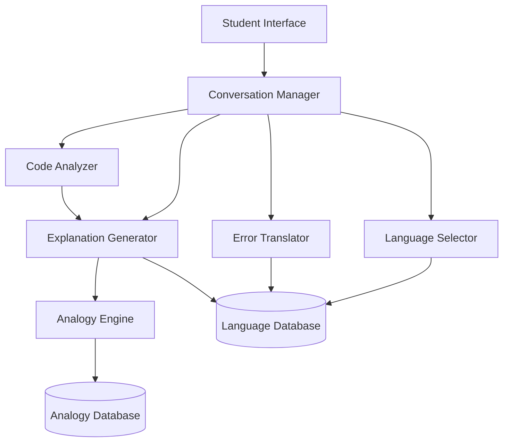

# Design Document: CodeSahayak

## Overview

CodeSahayak is a language-learning assistant for programming that bridges the gap between English-centric programming education and Indian students' native languages. The system consists of several interconnected components that work together to analyze code, translate errors, generate explanations, and provide culturally relevant analogies.

The architecture follows a modular design where each component has a specific responsibility:
- **Language Management**: Handles user language preferences
- **Code Analysis**: Parses and understands source code
- **Translation & Explanation**: Converts technical content to native languages
- **Analogy Generation**: Creates culturally relevant teaching aids
- **Conversation Management**: Maintains interactive learning sessions

## Architecture



### Component Interaction Flow

1. **Student submits request** → Conversation Manager receives input
2. **Language preference check** → Language Selector retrieves or sets language
3. **Request routing** → Conversation Manager routes to appropriate component:
   - Code snippet → Code Analyzer → Explanation Generator
   - Error message → Error Translator
   - Concept question → Explanation Generator
4. **Content generation** → Components generate responses using Language Database
5. **Analogy enhancement** → Analogy Engine adds cultural context when appropriate
6. **Response delivery** → Conversation Manager returns formatted response to student

## Components and Interfaces

### 1. Language Selector

**Responsibility**: Manage user language preferences and validate language support.

**Interface**:
```
class LanguageSelector:
    function setLanguage(studentId: String, language: String) -> Result<Unit, Error>
    function getLanguage(studentId: String) -> Result<String, Error>
    function getSupportedLanguages() -> List<String>
    function isLanguageSupported(language: String) -> Boolean
```

**Implementation Notes**:
- Supported languages: "hi" (Hindi), "ta" (Tamil), "kn" (Kannada), "ml" (Malayalam), "te" (Telugu), "en" (English)
- Language preferences stored persistently per student
- Default language is English if no preference is set
- Language codes follow ISO 639-1 standard

### 2. Code Analyzer

**Responsibility**: Parse source code, identify structure, detect programming language, and identify errors.

**Interface**:
```
class CodeAnalyzer:
    function analyzeCode(code: String, language: Optional<String>) -> Result<CodeAnalysis, Error>
    function detectLanguage(code: String) -> Result<String, Error>
    function identifySyntaxErrors(code: String, language: String) -> List<SyntaxError>
```

**Data Structures**:
```
structure CodeAnalysis:
    programmingLanguage: String
    syntaxTree: AST
    codeBlocks: List<CodeBlock>
    syntaxErrors: List<SyntaxError>
    qualityIssues: List<QualityIssue>

structure CodeBlock:
    lineStart: Integer
    lineEnd: Integer
    blockType: String  // "function", "loop", "conditional", "class", etc.
    content: String
    purpose: String
```

**Implementation Notes**:
- Use existing parsers for each programming language (e.g., Python's `ast` module, Esprima for JavaScript)
- Language detection based on syntax patterns and keywords
- Quality analysis checks for naming conventions, complexity, and common anti-patterns

### 3. Error Translator

**Responsibility**: Translate programming error messages into native languages with context and solutions.

**Interface**:
```
class ErrorTranslator:
    function translateError(errorMessage: String, targetLanguage: String, context: Optional<CodeContext>) -> Result<TranslatedError, Error>
    function identifyErrorType(errorMessage: String) -> ErrorType
```

**Data Structures**:
```
structure TranslatedError:
    originalError: String
    translatedMessage: String
    errorType: ErrorType
    likelyCause: String
    suggestedSolutions: List<String>
    
enumeration ErrorType:
    SYNTAX_ERROR
    TYPE_ERROR
    NAME_ERROR
    INDEX_ERROR
    ATTRIBUTE_ERROR
    IMPORT_ERROR
    RUNTIME_ERROR
    LOGIC_ERROR
```

**Implementation Notes**:
- Maintain error pattern database for common errors in each programming language
- Preserve technical terms (e.g., "variable", "function") in transliterated form when appropriate
- Context includes surrounding code to provide more specific translations

### 4. Explanation Generator

**Responsibility**: Generate code explanations and concept descriptions in the target language.

**Interface**:
```
class ExplanationGenerator:
    function explainCode(analysis: CodeAnalysis, targetLanguage: String) -> Result<CodeExplanation, Error>
    function explainConcept(concept: String, targetLanguage: String) -> Result<ConceptExplanation, Error>
    function explainCodeBlock(block: CodeBlock, targetLanguage: String) -> String
```

**Data Structures**:
```
structure CodeExplanation:
    overallPurpose: String
    blockExplanations: List<BlockExplanation>
    keyTakeaways: List<String>

structure BlockExplanation:
    block: CodeBlock
    explanation: String
    lineByLineDetails: List<LineExplanation>

structure LineExplanation:
    lineNumber: Integer
    code: String
    explanation: String

structure ConceptExplanation:
    conceptName: String
    definition: String
    codeExample: String
    exampleExplanation: String
    analogy: String
```

**Implementation Notes**:
- Use template-based generation with language-specific vocabulary
- Adapt technical depth based on code complexity
- Include code examples for concept explanations

### 5. Analogy Engine

**Responsibility**: Generate culturally relevant analogies to explain programming concepts.

**Interface**:
```
class AnalogyEngine:
    function generateAnalogy(concept: String, targetLanguage: String) -> Result<Analogy, Error>
    function getAnalogyForContext(concept: String, context: String, targetLanguage: String) -> Result<Analogy, Error>
```

**Data Structures**:
```
structure Analogy:
    concept: String
    analogyText: String
    connectionExplanation: String
    culturalContext: String

structure AnalogyTemplate:
    concept: String
    language: String
    templates: List<String>
    culturalReferences: List<String>
```

**Implementation Notes**:
- Maintain database of analogy templates per language
- Cultural references include: cricket, Indian festivals, food, transportation, family structures, Bollywood
- Example analogies:
  - Variables → "Dabba (container) that holds different items"
  - Functions → "Recipe that you can follow multiple times"
  - Loops → "Doing rounds (pheras) around the fire"
  - Arrays → "Railway compartments connected in sequence"
  - Classes → "Family tree with shared characteristics"

### 6. Conversation Manager

**Responsibility**: Maintain conversation context, route requests, and manage interactive sessions.

**Interface**:
```
class ConversationManager:
    function startSession(studentId: String) -> SessionId
    function processRequest(sessionId: SessionId, request: StudentRequest) -> Response
    function getSessionContext(sessionId: SessionId) -> SessionContext
    function endSession(sessionId: SessionId) -> Unit
```

**Data Structures**:
```
structure SessionContext:
    sessionId: SessionId
    studentId: String
    language: String
    conversationHistory: List<Interaction>
    currentTopic: Optional<String>
    
structure Interaction:
    timestamp: DateTime
    request: StudentRequest
    response: Response
    
structure StudentRequest:
    requestType: RequestType  // CODE_EXPLANATION, ERROR_TRANSLATION, CONCEPT_QUESTION, FEEDBACK
    content: String
    programmingLanguage: Optional<String>
    
enumeration RequestType:
    CODE_EXPLANATION
    ERROR_TRANSLATION
    CONCEPT_QUESTION
    CODE_FEEDBACK
    FOLLOW_UP_QUESTION
```

**Implementation Notes**:
- Session timeout after 30 minutes of inactivity
- Context includes last 10 interactions for follow-up question handling
- Request classification based on content analysis and keywords

## Data Models

### Language Database Schema

```
table translations:
    id: UUID (primary key)
    source_language: String
    target_language: String
    category: String  // "error", "concept", "keyword", "explanation"
    source_text: String
    translated_text: String
    context: Optional<String>
    
table technical_terms:
    id: UUID (primary key)
    term: String
    language: String
    transliteration: String
    translation: String
    usage_context: String
```

### Analogy Database Schema

```
table analogies:
    id: UUID (primary key)
    concept: String
    language: String
    analogy_text: String
    connection_explanation: String
    cultural_references: List<String>
    difficulty_level: String  // "beginner", "intermediate", "advanced"
    
table cultural_references:
    id: UUID (primary key)
    reference_name: String
    category: String  // "sports", "festivals", "food", "daily_life", etc.
    description: String
    applicable_languages: List<String>
```

### Session Storage

```
table sessions:
    session_id: UUID (primary key)
    student_id: String
    language: String
    created_at: DateTime
    last_activity: DateTime
    context: JSON  // Serialized SessionContext
```

## Data Models (continued)

### Student Preferences

```
table student_preferences:
    student_id: String (primary key)
    preferred_language: String
    programming_languages: List<String>  // Languages the student is learning
    difficulty_level: String
    created_at: DateTime
    updated_at: DateTime
```


## Correctness Properties

*A property is a characteristic or behavior that should hold true across all valid executions of a system—essentially, a formal statement about what the system should do. Properties serve as the bridge between human-readable specifications and machine-verifiable correctness guarantees.*

### Property 1: Language Preference Persistence

*For any* student ID and any supported language, if we set the language preference and then retrieve it in a new session, we should get the same language back.

**Validates: Requirements 1.2**

### Property 2: Language Change Takes Effect

*For any* student and any two different supported languages, changing the language preference should result in all subsequent operations (explanations, error translations) using the new language.

**Validates: Requirements 1.3**

### Property 3: Invalid Language Rejection

*For any* string that is not a supported language code, attempting to set it as a language preference should fail with an error.

**Validates: Requirements 1.4**

### Property 4: Code Analysis Produces Structure

*For any* valid code snippet in a supported programming language, the Code Analyzer should return a CodeAnalysis object with non-empty structure information (code blocks, syntax tree).

**Validates: Requirements 2.1**

### Property 5: Complete Code Explanations

*For any* code analysis result and any supported language, the Explanation Generator should produce explanations for each code block, and each explanation should include the purpose of the code element.

**Validates: Requirements 2.2, 2.4**

### Property 6: Syntax Error Detection

*For any* code snippet containing syntax errors, the Code Analyzer should identify and include those errors in the analysis result before generating explanations.

**Validates: Requirements 2.5**

### Property 7: Error Type Identification

*For any* valid error message from a supported programming language, the Error Translator should identify and return a recognized error type.

**Validates: Requirements 3.1**

### Property 8: Error Translation Completeness

*For any* error message and any supported language, the Error Translator should produce a translated message that includes the translated error text, likely cause, and at least one suggested solution.

**Validates: Requirements 3.2, 3.4, 3.5**

### Property 9: Analogies Include Cultural References

*For any* programming concept and any supported language, the generated analogy should contain cultural references appropriate to that language's cultural context.

**Validates: Requirements 4.1**

### Property 10: Language-Specific Analogy Adaptation

*For any* programming concept, generating analogies in different languages should produce different cultural references appropriate to each language's cultural context.

**Validates: Requirements 4.2**

### Property 11: Analogy Connection Explanation

*For any* generated analogy, the result should include a non-empty connection explanation that links the analogy to the programming concept.

**Validates: Requirements 4.3**

### Property 12: Programming Language Detection

*For any* valid code in a supported programming language, if the language is not specified, the Code Analyzer should correctly detect the programming language.

**Validates: Requirements 5.2**

### Property 13: Unsupported Language Handling

*For any* code in an unsupported programming language or ambiguous code, the Code Analyzer should return an error requesting clarification.

**Validates: Requirements 5.3**

### Property 14: Language-Specific Explanations

*For any* programming concept implemented in different supported languages, the explanations should reference language-specific features and syntax appropriate to each language.

**Validates: Requirements 5.4**

### Property 15: Complete Concept Explanations

*For any* programming concept and any supported language, the concept explanation should include all required sections: definition, at least one code example, and a culturally relevant analogy.

**Validates: Requirements 6.1, 6.2, 6.3, 6.4**

### Property 16: Conversation Context Maintenance

*For any* session, adding interactions to the conversation history should result in the session context containing all those interactions in subsequent retrievals.

**Validates: Requirements 7.1**

### Property 17: Quality Issue Detection

*For any* code containing known quality issues (naming conventions, structure problems, potential bugs), the Code Analyzer should identify and include those issues in the analysis result.

**Validates: Requirements 8.1**

### Property 18: Complete Quality Feedback

*For any* identified quality issue and any supported language, the feedback should include an explanation in that language, suggestions for improvement, and an explanation of why the issue matters.

**Validates: Requirements 8.2, 8.4**

### Property 19: Quality Issue Prioritization

*For any* code with multiple quality issues of different severities, the feedback should be ordered with critical issues appearing before style suggestions.

**Validates: Requirements 8.3**

## Error Handling

### Language Selection Errors

- **Unsupported Language**: Return error with list of supported languages
- **Invalid Language Code**: Return error with validation message
- **Persistence Failure**: Return error and maintain current language preference

### Code Analysis Errors

- **Unparseable Code**: Return error with syntax error details
- **Unknown Programming Language**: Request user to specify language
- **Empty Code Input**: Return error requesting valid code
- **Timeout**: Return error if analysis takes longer than 30 seconds

### Translation Errors

- **Unknown Error Pattern**: Provide generic translation with original error
- **Missing Translation**: Fall back to English with note about missing translation
- **Context Unavailable**: Provide translation without context-specific details

### Analogy Generation Errors

- **No Analogy Available**: Provide explanation without analogy
- **Concept Not Found**: Request clarification or provide similar concepts
- **Cultural Reference Unavailable**: Use generic analogy with note

### Session Management Errors

- **Session Expired**: Create new session and inform user
- **Invalid Session ID**: Return error and request new session
- **Context Retrieval Failure**: Continue with empty context

## Testing Strategy

### Dual Testing Approach

CodeSahayak will use both unit testing and property-based testing to ensure comprehensive coverage:

- **Unit tests**: Verify specific examples, edge cases, and error conditions
- **Property tests**: Verify universal properties across all inputs

### Property-Based Testing Configuration

We will use **Hypothesis** (for Python components) as our property-based testing library. Each property test will:
- Run a minimum of 100 iterations to ensure comprehensive input coverage
- Be tagged with a comment referencing the design document property
- Tag format: `# Feature: code-sahayak, Property {number}: {property_text}`

### Testing Focus Areas

**Unit Testing Focus**:
- Specific examples of code explanations in each language
- Known error message translations
- Edge cases: empty inputs, very long code, special characters
- Integration between components
- Database operations and persistence
- Session timeout behavior

**Property-Based Testing Focus**:
- Language preference persistence (Property 1)
- Language change effects (Property 2)
- Invalid input rejection (Property 3)
- Code analysis completeness (Properties 4, 5, 6)
- Error translation completeness (Properties 7, 8)
- Analogy generation (Properties 9, 10, 11)
- Programming language detection (Properties 12, 13, 14)
- Concept explanation structure (Property 15)
- Context maintenance (Property 16)
- Quality feedback (Properties 17, 18, 19)

### Test Data Strategy

**Code Samples**:
- Maintain repository of valid code samples in Python, JavaScript, Java, C++
- Include samples with syntax errors, quality issues, and edge cases
- Cover common programming patterns: loops, functions, classes, error handling

**Error Messages**:
- Collect common error messages from each supported programming language
- Include variations in error message format
- Cover all error types in the ErrorType enumeration

**Cultural References**:
- Validate analogy database contains diverse cultural references
- Ensure references are appropriate and non-offensive
- Test with native speakers of Hindi, Tamil, Kannada, Malayalam, and Telugu

**Translation Quality**:
- Periodic review of translations by native speakers
- A/B testing with students to measure comprehension
- Feedback mechanism for improving translations
- Ensure coverage for all six supported languages: Hindi, Tamil, Kannada, Malayalam, Telugu, and English

### Integration Testing

- End-to-end flows: code submission → analysis → explanation → student feedback
- Multi-turn conversations with context maintenance
- Language switching mid-session
- Concurrent session handling
- Database persistence and retrieval

### Performance Testing

- Response time for code analysis (target: < 2 seconds for typical code)
- Response time for error translation (target: < 500ms)
- Response time for concept explanation (target: < 1 second)
- Session storage and retrieval (target: < 100ms)
- Concurrent user handling (target: 100 concurrent sessions)
